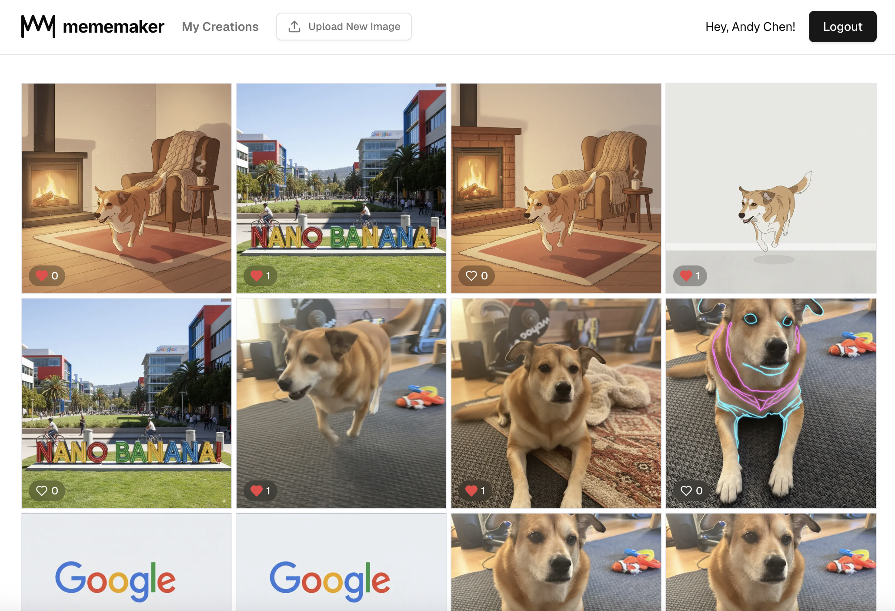

# Mememaker

An AI-powered image transformation and meme creation platform built with Next.js 15, Supabase, and Google's Nano Banana.

🔗 **Live Demo: [https://nano-banana-nine.vercel.app/](https://nano-banana-nine.vercel.app/)**



## Overview

Mememaker is a modern web application that allows users to upload images and remix them using AI-powered text prompts. Users can create unique memes and image variations, share them with the community, and interact through likes and comments.

## Features

- **AI-Powered Image Transformation** - Transform images using natural language prompts powered by Google Gemini 2.5 Flash
- **User Authentication** - Secure authentication with password-based login and Google OAuth integration
- **Image Upload** - Upload images up to 10MB with automatic storage in Supabase
- **Public Gallery** - Browse all created images in a responsive grid layout
- **Personal Collection** - View and manage your own creations in a dedicated page
- **Social Interactions** - Like and comment on images from the community
- **Theme Support** - Dark and light theme toggle with persistent preferences
- **Real-time Updates** - Live authentication state and instant UI updates

## Tech Stack

- **Framework**: [Next.js 15](https://nextjs.org/) with App Router and React Server Components
- **Language**: TypeScript
- **UI Library**: React 19
- **Styling**: [Tailwind CSS](https://tailwindcss.com/)
- **Components**: [shadcn/ui](https://ui.shadcn.com/)
- **Backend**: [Supabase](https://supabase.com/) (Auth, Database, Storage)
- **AI**: [Google's Nano Banana](https://ai.google.dev/) (Gemini 2.5 Flash - gemini-2.5-flash-image-preview model)
- **Icons**: [Lucide React](https://lucide.dev/)
- **Linting**: [Biome](https://biomejs.dev/) + ESLint

## Prerequisites

Before you begin, ensure you have:

- Node.js 20.x or later
- npm, yarn, or pnpm
- A [Supabase](https://supabase.com/) account and project
- A [Google Cloud Console](https://console.cloud.google.com/) project with OAuth credentials
- A [Google AI Studio](https://makersuite.google.com/app/apikey) API key for Gemini

## Installation

1. **Clone the repository**

   ```bash
   git clone <your-repo-url>
   cd nano-banana
   ```

2. **Install dependencies**

   ```bash
   npm install
   ```

3. **Set up environment variables**

   Copy the example environment file and fill in your credentials:

   ```bash
   cp .env.example .env.local
   ```

   Update `.env.local` with your credentials:

   ```env
   # Supabase Configuration
   # Get these from: https://app.supabase.com/project/_/settings/api
   NEXT_PUBLIC_SUPABASE_URL=your-project-url
   NEXT_PUBLIC_SUPABASE_PUBLISHABLE_OR_ANON_KEY=your-anon-key

   # Google OAuth for app
   # Get from: https://console.cloud.google.com/apis/credentials
   NEXT_PUBLIC_GOOGLE_CLIENT_ID=your-google-client-id

   # Google Gemini AI
   # Get from: https://makersuite.google.com/app/apikey
   GEMINI_API_KEY=your-gemini-api-key

   # Google OAuth credentials for Supabase (get from Google Cloud Console)
   GOOGLE_CLIENT_ID=your-google-client-id
   GOOGLE_CLIENT_SECRET=your-google-client-secret
   ```

4. **Set up Supabase**

   The project includes database migrations in `supabase/migrations/`. Apply them using the Supabase CLI:

   ```bash
   # Install Supabase CLI if you haven't already
   npm install -g supabase

   # Link to your project
   supabase link --project-ref your-project-ref

   # Run migrations
   supabase db push
   ```

5. **Configure Google OAuth in Supabase**

   In your Supabase dashboard:
   - Go to Authentication > Providers
   - Enable Google provider
   - Add your Google Client ID and Client Secret
   - Add authorized redirect URIs in Google Console

## Running the Application

### Development Mode

```bash
npm run dev
```

The app will be available at [http://localhost:3000](http://localhost:3000)

The development server uses Turbopack for faster builds and hot module replacement.

### Production Build

```bash
npm run build
npm start
```

### Linting

```bash
npm run lint
```

## How It Works

### AI Image Transformation

The app uses Google's Nano Banana (Gemini 2.5 Flash) with image capabilities to transform uploaded images based on text prompts. Images are processed server-side and automatically saved to your gallery.

## Deployment

### Deploy to Vercel

The easiest way to deploy this Next.js app is to use [Vercel](https://vercel.com):

[](https://vercel.com/new)

1. Push your code to GitHub
2. Import your repository in Vercel
3. Add environment variables in Vercel dashboard
4. Deploy!

Vercel will automatically:
- Build your Next.js application
- Set up continuous deployment from your Git repository
- Provide a production URL
- Handle serverless functions for API routes

### Environment Variables for Production

Make sure to add all environment variables from `.env.local` to your production environment (Vercel, Railway, etc.)

### Supabase Production Setup

1. Ensure all migrations are applied to your production database
2. Configure storage buckets with proper access policies
3. Set up authentication providers in Supabase dashboard
4. Add your production URLs to allowed redirect URLs

## Contributing

1. Fork the repository
2. Create a feature branch (`git checkout -b feature/amazing-feature`)
3. Commit your changes (`git commit -m 'Add amazing feature'`)
4. Push to the branch (`git push origin feature/amazing-feature`)
5. Open a Pull Request

## Acknowledgments

- Built with [Next.js](https://nextjs.org/)
- Powered by [Supabase](https://supabase.com/)
- AI capabilities by [Google Gemini](https://ai.google.dev/)
- UI components from [shadcn/ui](https://ui.shadcn.com/)